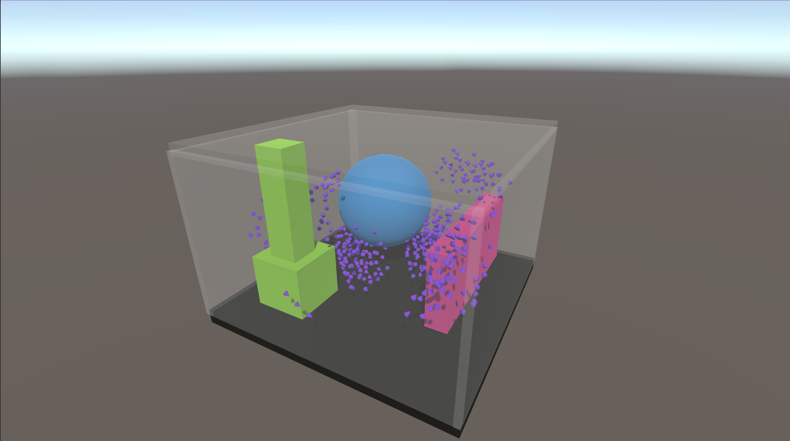

# Unity Boids

This project on Unity implements the Boids algorithm to simulate flock behavior. The algorithm is implemented on both CPU and GPU for performance comparison.

## Requirements

- Unity 2021.3.24f1 or higher

## Project Structure

- `Spawner.cs`: Script for creating and placing Boids in the scene.
- `BoidHelper.cs`: Helper class for calculating directions.
- `BoidManager.cs`: Abstract class for managing Boids.
- `BoidManagerCPU.cs`: Implementation of Boids management on the processor.
- `BoidManagerGPU.cs`: Implementation of Boids management on video card.
- `Boid.cs`: A class representing an individual Boid.
- `BoidData.cs`: Data structure for Boids.
- `BoidSettings.cs`: Settings for Boids.
- `BoidCompute.compute`: A shader to compute the behavior of Boids on the graphics card.

## Installation

1. Clone the repository or download the project.
2. Open the project in Unity 2021.3.24f1 or higher.

## Using

1. Add a Spawner to the scene to create Boids.
2. Configure Spawner parameters in the inspector, such as Boid prefab, spawn radius, number of Boids, and color.
3. Add a BoidManagerCPU or BoidManagerGPU to the scene to control the Boids.
4. Configure BoidManager parameters such as BoidSettings and target.
5. Add obstacles and set the `Wall` or `Obstacle` layer for them.

## Performance Comparison

The project includes two implementations of the Boids algorithm:
- CPU: An implementation on the CPU that uses the `BoidManagerCPU` class.
- GPU: A video card implementation that uses the `BoidManagerGPU` class and the `BoidCompute.compute` shader.

You can switch between these implementations and compare their performance depending on the number of Boids and the complexity of the scene.

#### Comparison results

| Number of Boids  | CPU FPS | GPU FPS |
|------------------|---------|---------|
| 50               | 315     | 300     |
| 500              | 55      | 125     |
| 5000             | 0.9     | 13      |
