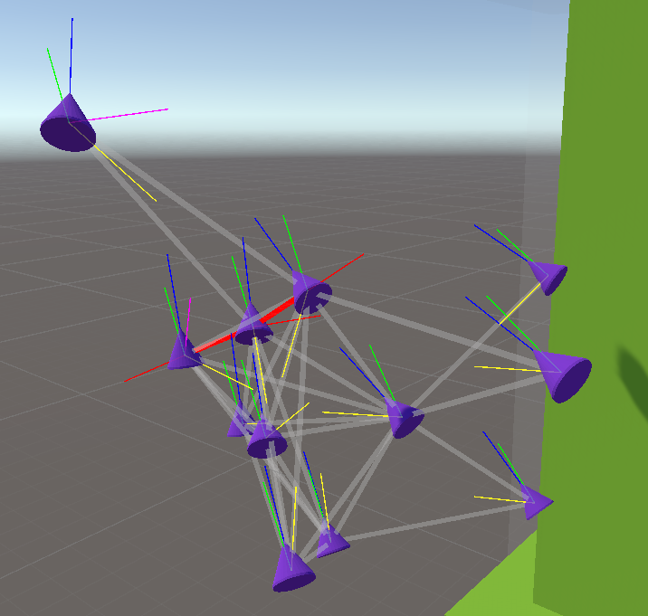
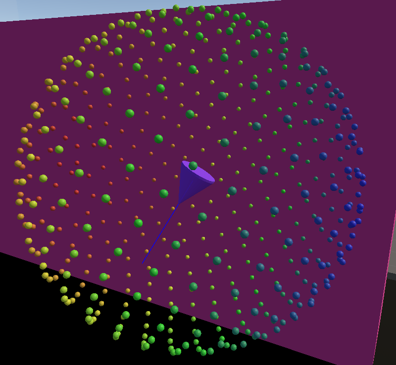

# Unity Boids

This project on Unity implements the Boids algorithm to simulate flock behavior. The algorithm is implemented on both CPU and GPU for performance comparison.

## Requirements

- Unity 2021.3.24f1 or higher

## Project Structure

- `Spawner.cs`: Script for creating and placing Boids in the scene.
- `BoidHelper.cs`: Helper class for calculating directions.
- `BoidManager.cs`: Abstract class for managing Boids.
- `BoidManagerCPU.cs`: Implementation of Boids management on the processor.
- `BoidManagerGPU.cs`: Implementation of Boids management on video card.
- `Boid.cs`: A class representing an individual Boid.
- `BoidData.cs`: Data structure for Boids.
- `BoidSettings.cs`: Settings for Boids.
- `BoidCompute.compute`: A shader to compute the behavior of Boids on the graphics card.
- `BoidVisualizer.cs`: Visualization tool for boid behaviors, vectors, and connections.
- `DirectionPointsVisualizer.cs`: Helper class for visualizing direction points as a gradient sphere.

## Installation

1. Clone the repository or download the project.
2. Open the project in Unity 2021.3.24f1 or higher.

## Using

1. Add a Spawner to the scene to create Boids.
2. Configure Spawner parameters in the inspector, such as Boid prefab, spawn radius, number of Boids, and color.
3. Add a BoidManagerCPU or BoidManagerGPU to the scene to control the Boids.
4. Configure BoidManager parameters such as BoidSettings and target.
5. Add obstacles and set the `Wall` or `Obstacle` layer for them.
6. _(Optional)_ Add BoidVisualizer component to the BoidManager object to visualize boid behaviors.

## Visualization

The project includes visualization tools to help understand and debug the Boids algorithm:

### BoidVisualizer

This component allows you to visualize various aspects of boid behavior:

- **Direction Vectors**: Shows the forward direction of each boid (blue), alignment (green), cohesion (yellow), separation (red), and collision avoidance (magenta) vectors.
- **Flock Connections**: Displays lines between boids that are within perception range, with different colors indicating whether they're in avoidance range.
- **Perception & Avoidance Radii**: Visualizes the perception and avoidance spheres for each boid.
- **Direction Points**: Shows gradient-colored points on a sphere around each boid representing possible movement directions.

To use:
1. Add the BoidVisualizer component to the same GameObject that has your BoidManagerCPU component
2. Configure visualization settings in the inspector
3. In Play mode, toggle different visualizations on/off to observe different aspects of the algorithm

### DirectionPointsVisualizer

This helper class creates a beautiful visualization of the direction sampling sphere used by boids to avoid obstacles:

- Displays points from the BoidHelper.Directions array as small spheres
- Colors each point according to a configurable gradient
- Allows adjustment of point size and visualization radius

This visualization helps understand how boids sample directions to avoid obstacles and make navigation decisions.

## Performance Comparison

The project includes two implementations of the Boids algorithm:
- CPU: An implementation on the CPU that uses the `BoidManagerCPU` class.
- GPU: A video card implementation that uses the `BoidManagerGPU` class and the BoidCompute.compute shader.

You can switch between these implementations and compare their performance depending on the number of Boids and the complexity of the scene.

#### Comparison results

| Number of Boids  | CPU FPS | GPU FPS |
|------------------|---------|---------|
| 50               | 315     | 300     |
| 500              | 55      | 125     |
| 5000             | 0.9     | 13      |
